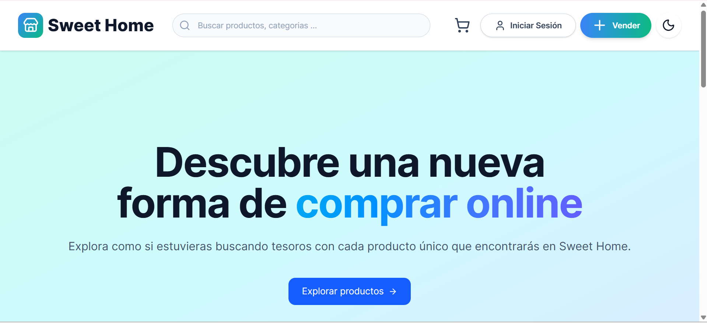
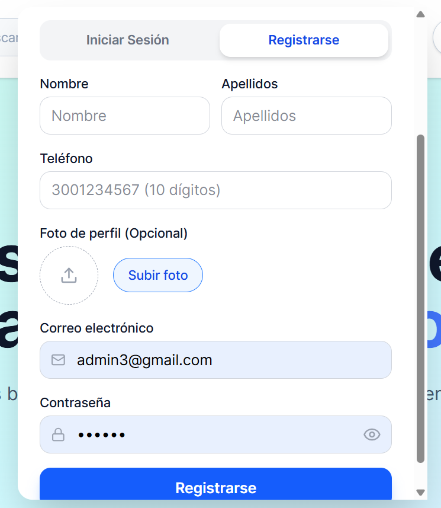
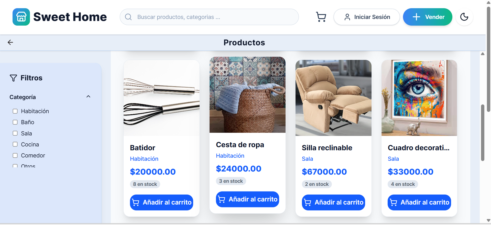
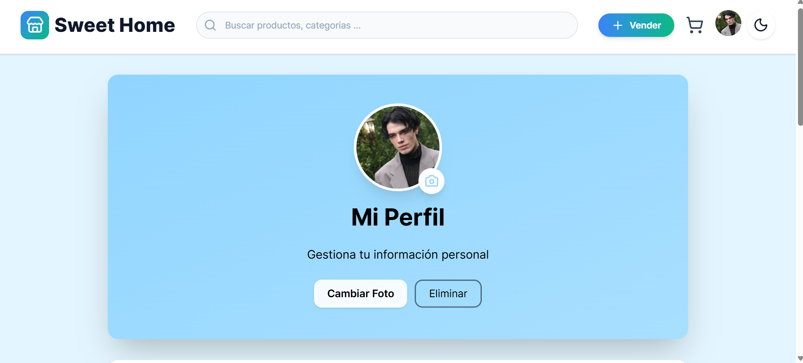
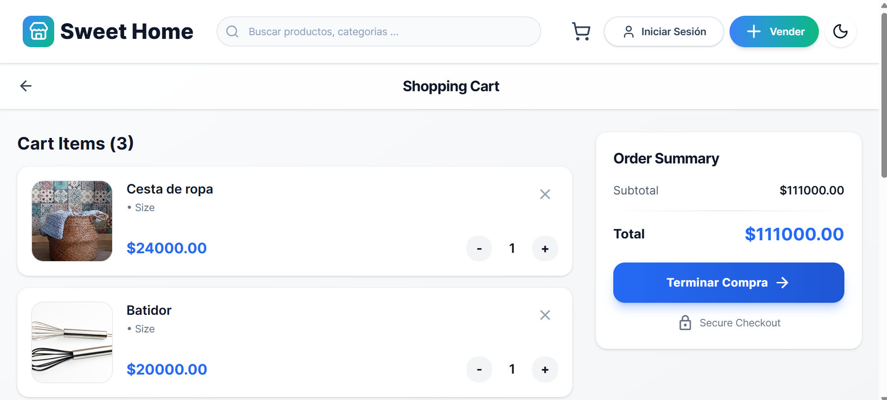
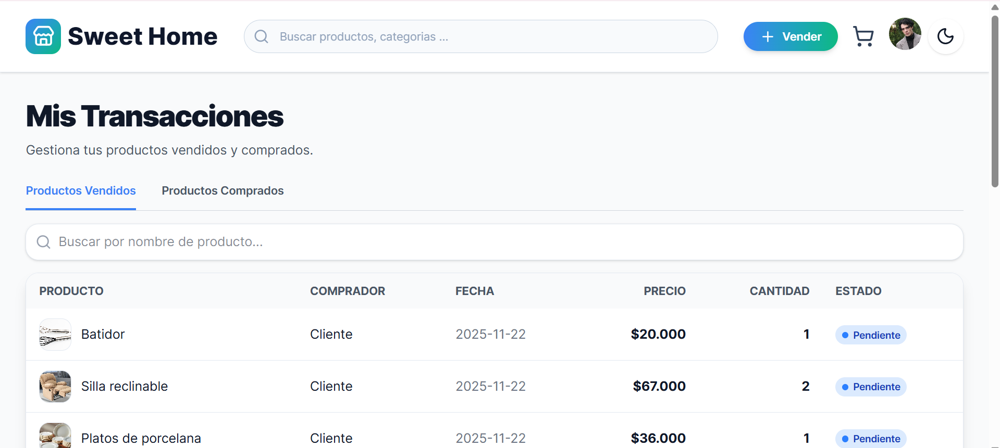

# 🏡 Sweet Home - Sistema de Venta de Garage  

**Spring Boot + JavaScript + MySQL**  

Sweet Home es una aplicación web para la **compra y venta de artículos usados**, tipo “venta de garage”.  
Permite a los usuarios **publicar productos**, **comunicarse con vendedores** y **gestionar pedidos** fácilmente desde sus dispositivo.  

---

## Vista Previa del Proyecto  

| Página Principal | Login | Registrarse como usuario |
|------------------|-----------------------|----------------------|
|  |  |  |


| Catálogo de productos | Perfil del usuario | Carrito de compras |
|------------------|-----------------------|----------------------|
|  |  |  |

| Transacciones del usuario (ventas-compras)| 
|----------|
|  | 

---

## Características Principales  

- Gestión de Productos
- Pedidos
- Búsqueda Avanzada — Filtra por nombre, categoría
- Comunicación Directa — Contacto rápido entre comprador y vendedor  
- Diseño Responsive 
- Seguridad JWT — Autenticación y control de acceso con Spring Security  
---

##  Tabla de Contenido
1. [Instalación y Configuración](#instalación-y-configuración)     
2. [Tecnologías Utilizadas](#tecnologías-utilizadas)  
3. [Estructura del Proyecto](#️estructura-del-proyecto)
4. [Equipo de Desarrollo](#equipo-de-desarrollo)  


---

## Instalación y Configuración

###  Requisitos Previos  
Asegúrate de tener instalado:  
- Node.js 18+
- MongoDB (local o Atlas)
- Git
- NPM o Yarn
- Vite (para React)


---

### Instalación Paso a Paso

####  Clonar el Repositorio  
```bash
git clone https://github.com/LauraRosas10/Sweet-Home.git
cd SweetHome
```


### Ejecución del Proyecto
Puertos:
- Backend	5100

- Frontend 5730


### Estructura del Proyecto
```bash
Sweet-Home/
Frontend/
├── public/
│
├── src/
│   ├── api/              # Lógica para conectarse al backend (peticiones)
│   ├── assets/           # Imágenes, íconos y recursos estáticos
│   ├── components/       # Componentes reutilizables (botones, cards, navbar...)
│   ├── routes/           # Rutas y páginas principales de la app
│   ├── App.jsx           # Componente principal
│   ├── main.jsx          # Punto de entrada
│   └── styles.css        # Estilos globales
│
├── .env                  # Variables de entorno (URL del backend)
├── index.html            # HTML base
├── package.json          # Dependencias del proyecto
├── vite.config.js        # Configuración de Vite
└── tailwind.config.js    # Configuración de Tailwind


Backend/
├── config/               # Conexión a MongoDB y configuraciones
│
├── controllers/          # Lógica de cada ruta (productos, usuarios, login…)
│
├── helpers/              # Funciones auxiliares (validaciones, tokens…)
│
├── models/               # Modelos de MongoDB (Product, User…)
│
├── routers/              # Rutas Express (products.routes.js, users.routes.js…)
│
├── schemas/              # Validaciones (Joi o Zod si las usaste)
│
├── app.js                # Configuración principal de Express
├── package.json          # Dependencias del backend
└── .gitignore
```


### Equipo de Desarrollo
Nombres:
* Laura Rosas
* Justin Galvis


